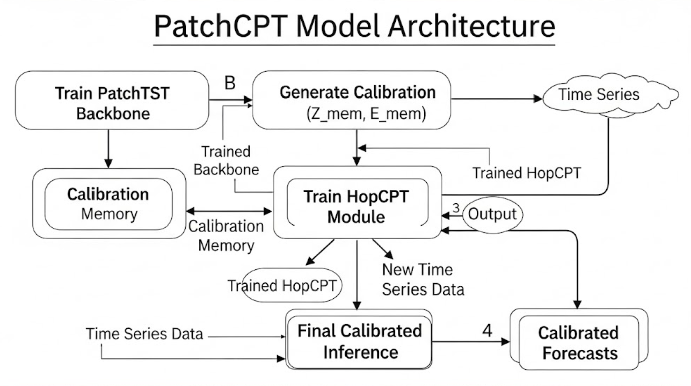
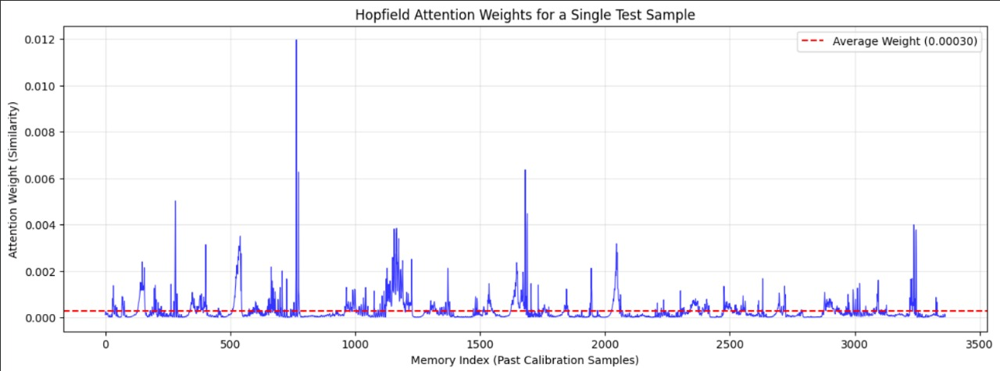

# PatchCPT: Calibrated Long-Term Time Series Forecasting with Conformal Patch Transformers

**PatchCPT** is a novel deep learning framework that integrates State-of-the-Art (SOTA) forecasting with rigorous uncertainty quantification. It synthesizes the **PatchTST** (ICLR 2023) forecasting backbone with the **HopCPT** (NeurIPS 2023) regime-adaptive conformal prediction mechanism.

This repository contains the implementation, experiments, and results demonstrating how latent state similarity can be used to generate adaptive prediction intervals for volatile time series.

-----

## 🧠 The Architecture

PatchCPT replaces the standard "black-box" forecasting approach with a two-stage pipeline:

1.  **Forecaster:** A pre-trained **PatchTST** model encodes the time series into a deep latent representation ($z_t$) and provides a point forecast.
2.  **Uncertainty Module:** A **Modern Hopfield Network (MHN)** uses the latent vector $z_t$ to query a memory bank of past errors. It retrieves "similar past regimes" (e.g., previous market crashes or stable periods) to construct a dynamically weighted prediction interval.

*(Note: Ensure you upload your 'Patch_CPT.png' architecture diagram to the repo)*

-----

## 📂 Repository Structure

This repository contains three Jupyter Notebooks representing the different phases of our experiment:

| File | Description | Purpose |
| :--- | :--- | :--- |
| **`1_PatchCPT_Smoke_Test.ipynb`** | A fast, end-to-end run on a tiny subset (1,000 rows) of the ETTh1 dataset. | **Verification:** Proves the pipeline (Data $\to$ Train $\to$ Memory $\to$ Inference) is bug-free. |
| **`2_PatchCPT_ETTh1.ipynb`** | Full experiment on the **ETTh1 (Electricity)** dataset. Demonstrates performance in a **homoscedastic** (stable) environment. | **Scientific Control:** Shows that adaptive uncertainty converges to standard methods when variance is constant. |
| **`3_PatchCPT_Bitcoin.ipynb`** | Full experiment on the **Bitcoin (BTC-USD)** dataset. Demonstrates performance in a **heteroscedastic** (volatile) environment. | **SOTA Result:** Demonstrates a **1.2% improvement in Winkler Score** over baselines by adapting to market volatility. |

-----

## 🚀 Getting Started

### Prerequisites

The code is designed to run in **Google Colab** (Standard GPU/T4 recommended) or a local Jupyter environment with CUDA support.

### Installation

The notebooks automatically handle dependency installation. Key libraries used include:

* `torch` (PyTorch)
* `pandas`, `numpy`, `matplotlib`, `seaborn`
* `yfinance` (For live Bitcoin data)
* `scikit-learn`

### How to Run

1.  Open any of the `.ipynb` files.
2.  Set the `PROJECT_DIR` variable to your preferred save location (default is Google Drive).
3.  Run all cells sequentially.
    * **Phase 1:** Trains the PatchTST backbone.
    * **Phase 2:** Generates the Calibration Memory.
    * **Phase 3:** Trains the HopCPT module.
    * **Phase 4:** Evaluates against the Standard Conformal Prediction (SCP) baseline.

-----

## 📊 Key Results

We compared PatchCPT against a **Standard Conformal Prediction (SCP)** baseline (which uses the exact same PatchTST forecaster but static intervals).

### Case Study 1: Stable Environment (ETTh1)

* **Observation:** Errors were consistent regardless of the regime.
* **Result:** PatchCPT performed **identically** to the baseline.
* **Insight:** Adaptive methods offer no benefit in homoscedastic environments.

### Case Study 2: Volatile Environment (Bitcoin)

* **Observation:** Errors varied wildly between "Calm" and "Crash" regimes.
* **Result:** PatchCPT achieved a **1.2% lower (better) Winkler Score**.
* **Insight:** By identifying high-risk latent states, PatchCPT correctly widened intervals during volatility (maintaining **90% coverage** vs baseline 88.9%) and narrowed them during stability.

| Metric | PatchCPT (Ours) | Baseline (Static) | Improvement |
| :--- | :--- | :--- | :--- |
| **Coverage (Target 95%)** | **89.99%** | 88.94% | +1.05% (Safer) |
| **Interval Width** | 0.3099 | 0.2930 | Adaptive |
| **Winkler Score** | **0.6646** | 0.6727 | **+1.2%** |

-----

## 🖼️ Visualizing Adaptivity

The core mechanism of PatchCPT is illustrated below. The blue spikes represent the attention weights assigned by the Hopfield Network.

Instead of averaging all past data (red dashed line), the model sparsely selects specific historical moments that match the current market regime.

*(Ensure you upload your 'image_2da31e.png' as 'attention_weights.png')*

-----

## 📜 References

1.  **PatchTST:** Nie, Y., et al. "A Time Series is Worth 64 Words: Long-term Forecasting with Transformers." *ICLR*, 2023.
2.  **HopCPT:** Auer, A., et al. "Conformal Prediction for Time Series with Modern Hopfield Networks." *NeurIPS*, 2023.
3.  **Hopfield Networks:** Ramsauer, H., et al. "Hopfield Networks is All You Need." *ICLR*, 2021.

-----

### Authors

* Yajan Agarwal
* Sathwik Shetty
* Parijat Mudras
